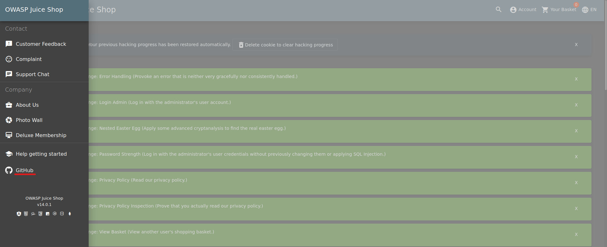
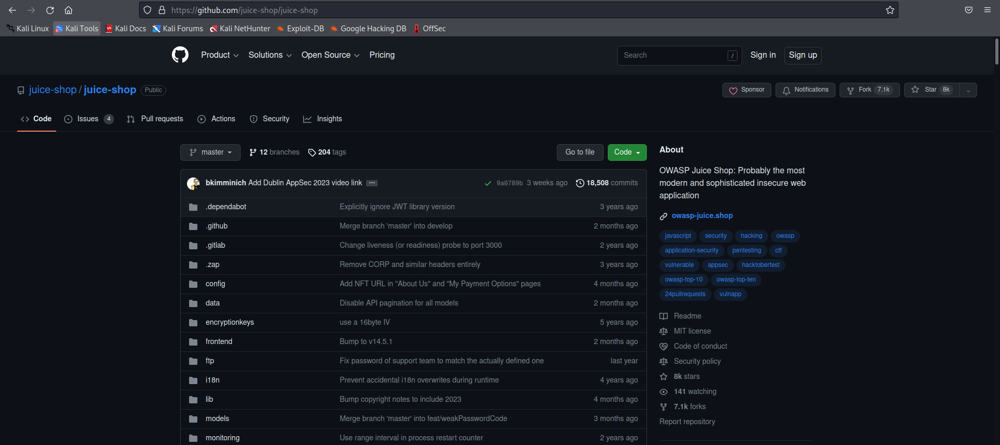
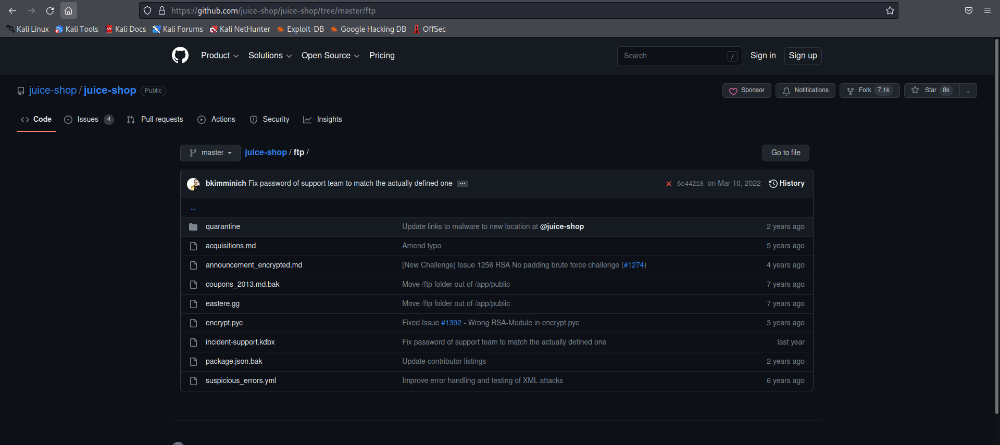
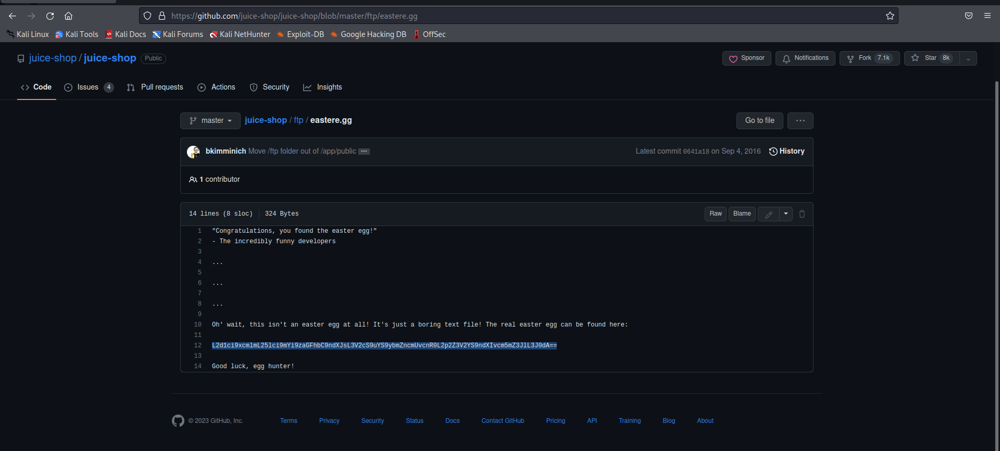
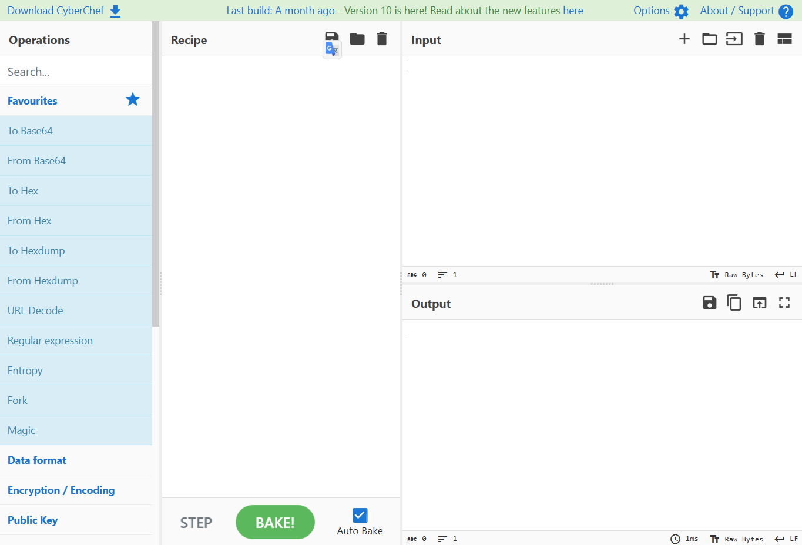
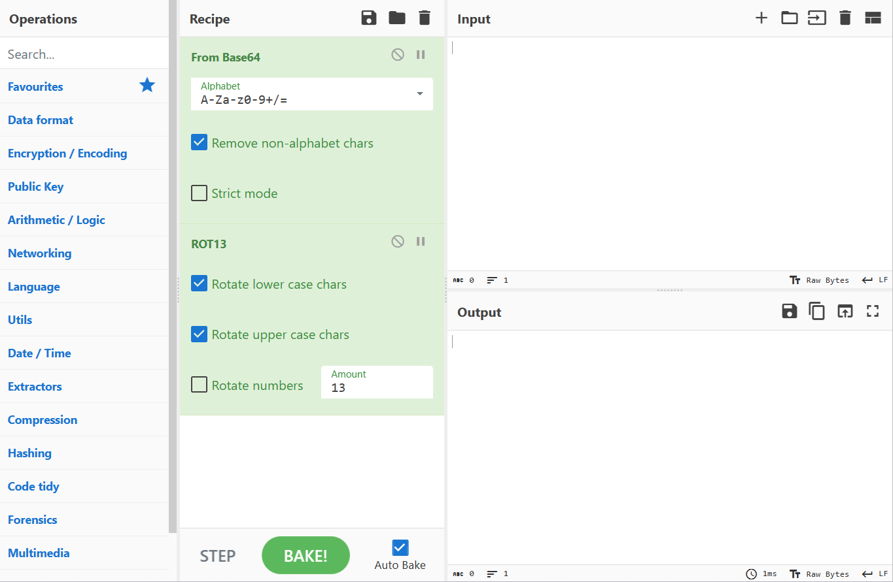
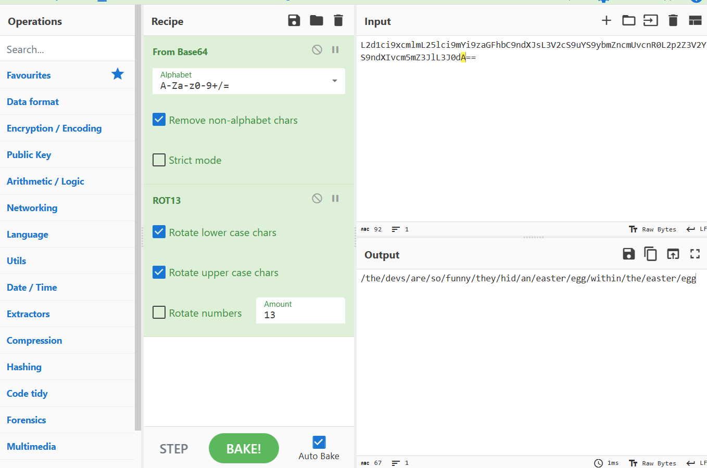
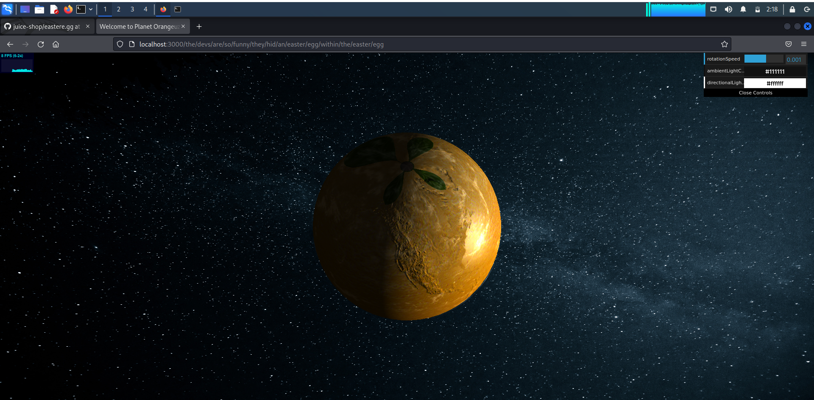

<h1>Praktikum Keamanan Jaringan 
A2 Cryptogaphic Failures (OWASP 10 Juice Shop)</h1>

Oleh :
Yofika Audrey Tisnawati
3122640036
LJ D4 Teknik Informatika B

<b>POLITEKNIK ELEKTRONIKA NEGERI SURABAYA
TAHUN AJARAN 2022/2023</b>

<h2><b>A. Nested Easter Egg</b></h2>
Challenge nested easter egg bertujuan untuk menemukan pesan tersembunyi yang telah disisipkan kedalam website
1. Buka aplikasi juice shop lalu menuju navbar, klik halaman github yang tersedia

2. Setelah itu cari folder ftp dan masuk ke file eastre.gg

3. Pada file tersebut terdapat kode "L2d1ci9xcmlmL25lci9mYi9zaGFhbC9ndXJsL3V2cS9uYS9ybmZncmUvcnR0L2p2Z3V2YS9ndXIvcm5mZ3JlL3J0dA==", copy code tersebut

4. Buka website cyberchef

5. Tambahkan From Base64 dan ROT13 pada operation

6. Masukkan code yang di dapat dari pada file eastre.gg. Akan muncul alamat pada output, copy alamat tersebut.

7. Buka alamat tersebut pada aplikasi juice shop maka akan muncul seperti ini. Challenge Nested Easter Egg berhasil dipecahkan

<h2><b>B. Weird Crypto</b></h2>

