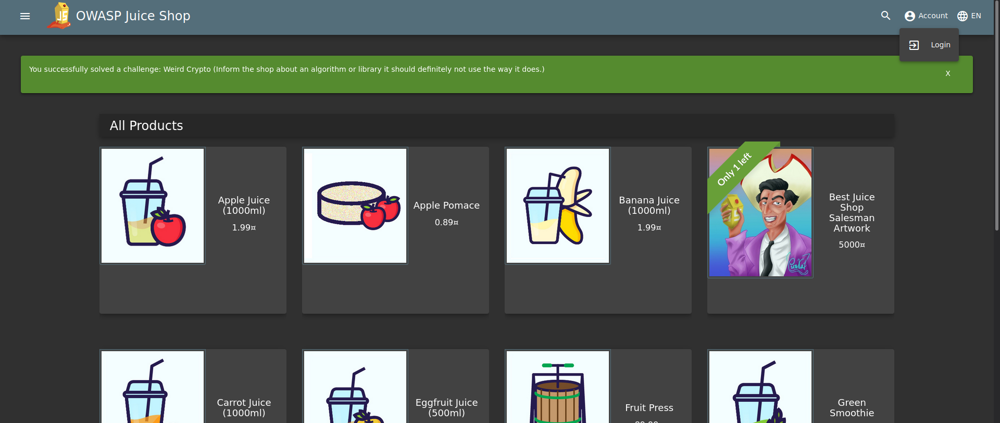
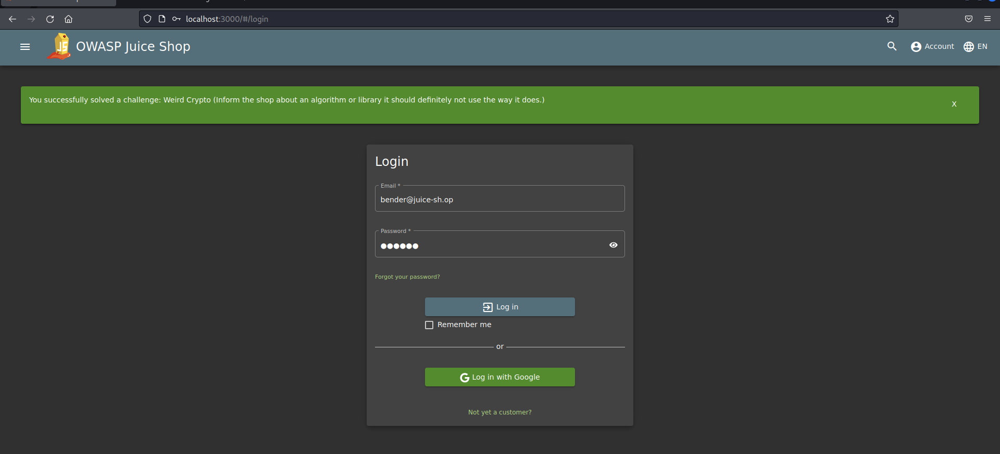
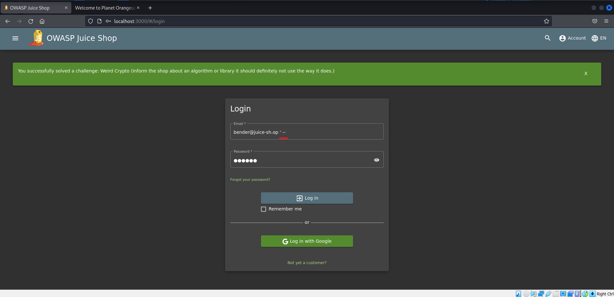
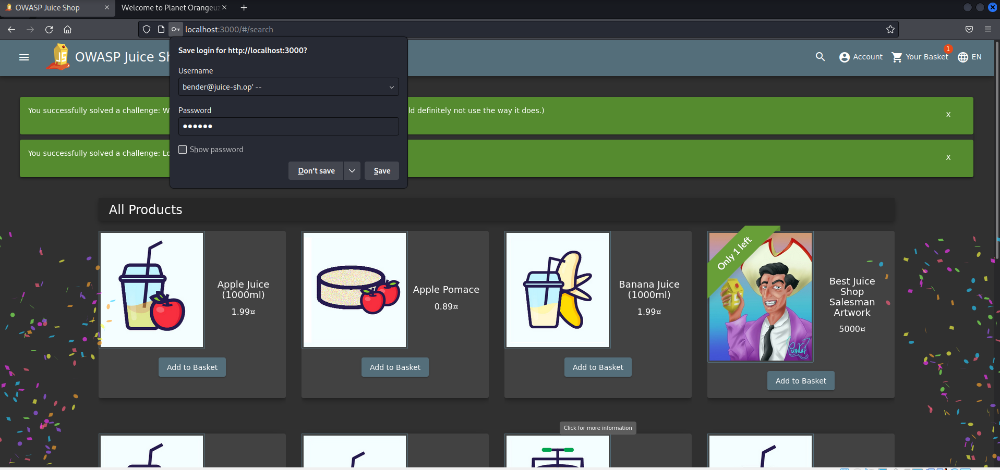
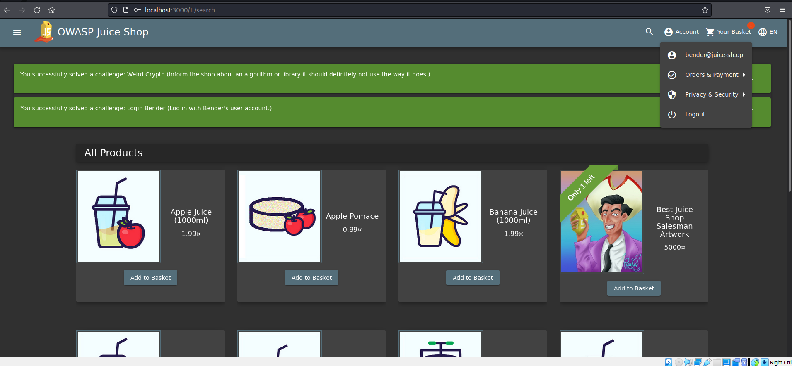
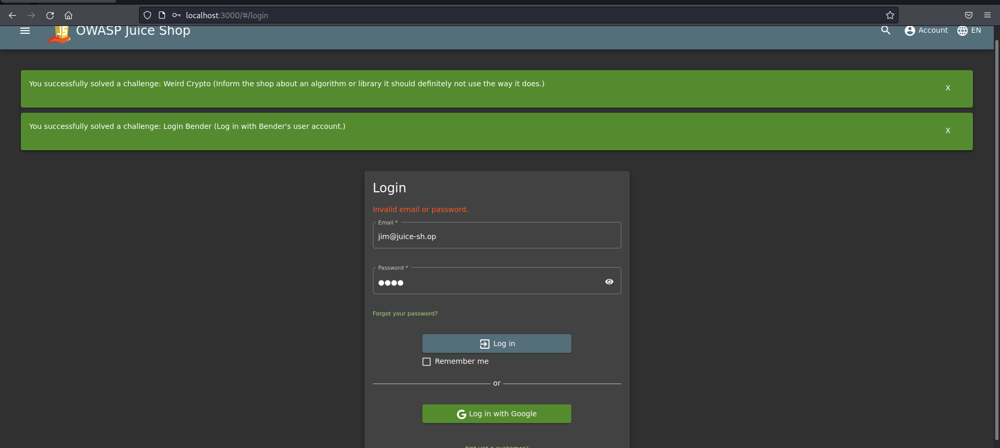
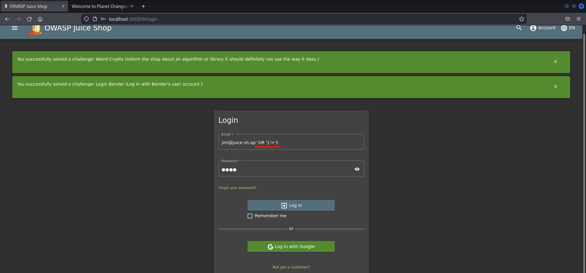
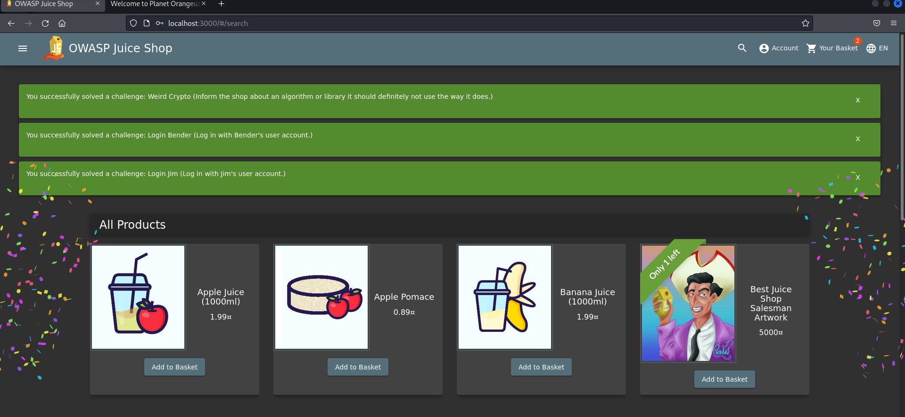
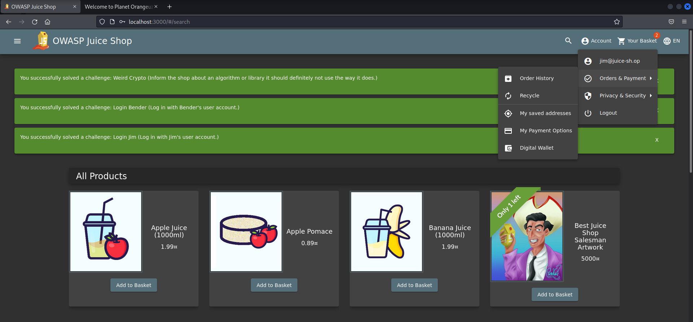

<h1>Praktikum Keamanan Jaringan 
A3 Injection</h1>

Oleh :
Yofika Audrey Tisnawati
3122640036
LJ D4 Teknik Informatika B

<h2><b>A. Bender Login</b></h2>

Challenge Bender login bertujuan untuk melakukan login menggunakan akun email bender@juice-sh.op menggunakan injection

1. Buka halaman login pada bagian account lalu login.

2. Setelah itu masukkan email bender@juice-sh.op dan dengan password diisi dengan inputan acak. Ketika disubmit maka hasilnya akan muncul pesan error "Invalid username or password".

3. Untuk melakukan injection tambahkan ' -- setelah email yang diinputkan. Tujuan dari inputan tersebut adalah digunakan untuk menonaktifkan argumen query sql setelahnya atau melakukan comment jadi kita dapat menonaktifkan kondisi pengecekan passwordnya.

4. Setelah itu submit form dan challenge akan terselesaikan serta berhasil masuk sebagai user bender

<h2><b>B. Jim Login</b></h2>

Challenge Jim login memiliki tujuan yang tidak jauh berbeda dengan bender login yaitu untuk melakukan login menggunakan akun email jim@juice-sh.op menggunakan injection

1. Buka halaman login pada bagian account lalu login.

2. Setelah itu masukkan email jim@juice-sh.op dan dengan password diisi dengan inputan acak. Ketika disubmit maka hasilnya akan muncul pesan error "Invalid username or password".

3. Untuk melakukan injection tambahkan ' OR '1'='1. Tujuan dari inputan tersebut adalah digunakan untuk menambahkan kondisi jika 1=1 maka kondisi return pasti sama dengan true, maka login akan berhasil dilakukan.

4. Setelah itu submit form dan challenge akan terselesaikan serta berhasil masuk sebagai user bender

