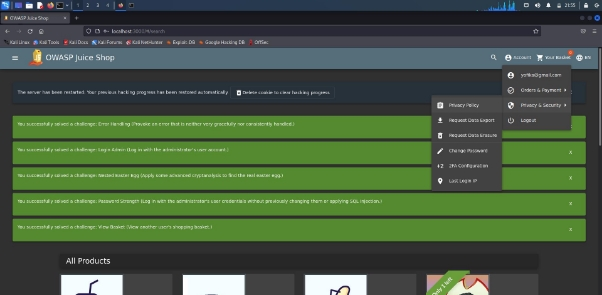
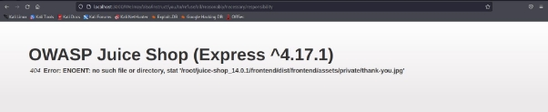
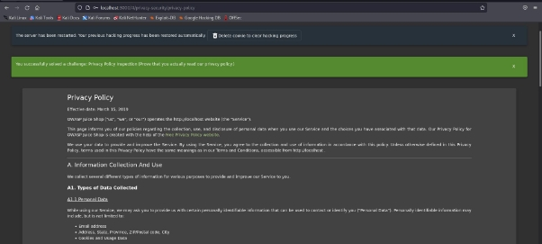

**Laporan Praktikum Keamanan Jaringan**

**A04 INSECURE DESIGN**

**Oleh :**

Yofika Audrey Tisnawati 3122640036

LJ D4 Teknik Informatika B

**POLITEKNIK ELEKTRONIKA NEGERI SURABAYA TAHUN AJARAN 2022/2023**

**Privacy Policy Inspection**

Challenge privacy policy inspection bertujuan untuk memastikan bahwa kita telah benar-benar membaca privacy policy yang terdapat di dalam aplikasi juice shop.

1. Buka halaman juice shop lalu login ke akun yang telah terdaftar. Setelah itu masuk ke halaman privacy policy dalam menu privacy and security.

2. Ketika membuka halaman privacy policy challenge privacy policy akan terselesaikan. Namun kali ini kita akan memecahkan challenge privacy policy inspection. Karena itu ada yang harus diinspect dalam halaman ini. Ketika dilihat, link yang diberikan di kedua pertama pada privacy policy terdapat hover berwarna kuning orange.

3. Saat saya mencoba inspect pada elemen tersebut, ternyata pada link yang muncul hovernya menggunakan class hot.

4. Kita akan mencoba kembali mencari elemen dengan class hot. Disini ditemukan “We may also” yang juga menggunakan class hot dan ketika dicek pada hovernya juga terdapat cahaya kuning orange sama seperti link awal tadi.

5. Lanjut untuk mencari elemen apa saja yang menggunakan class hot

6. Dari kode-kode unik berikut, saya coba menyusunnya untuk menjadi sebuah alamat

7. Ketika dibuka alamat tersebut menampilkan pesan error, website mencoba menampilkan image thank-you.jpg namun gagal karena file tidak ditemukan

8. Ketika dicek kembali pada aplikasi juice shop challenge privacy policy insepction telah terselesaikan

