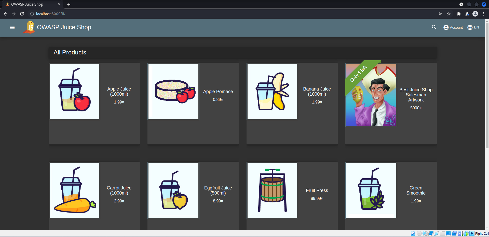
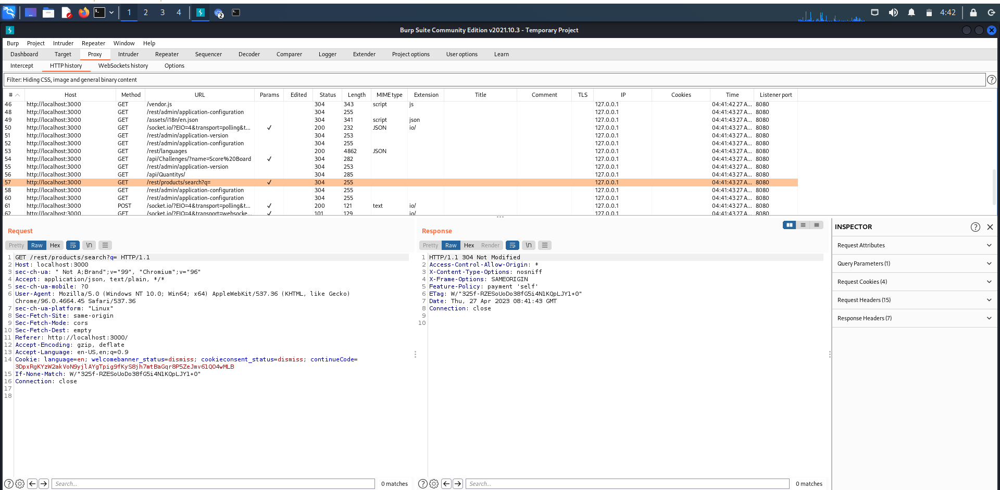
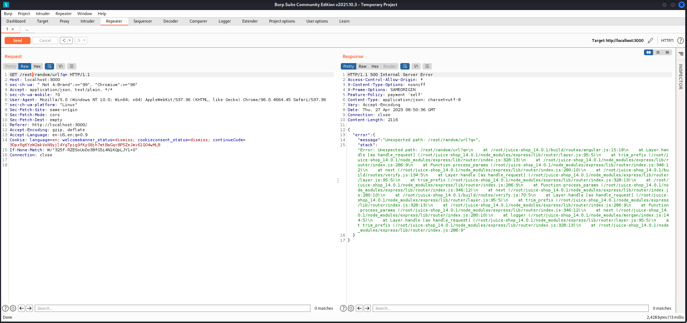
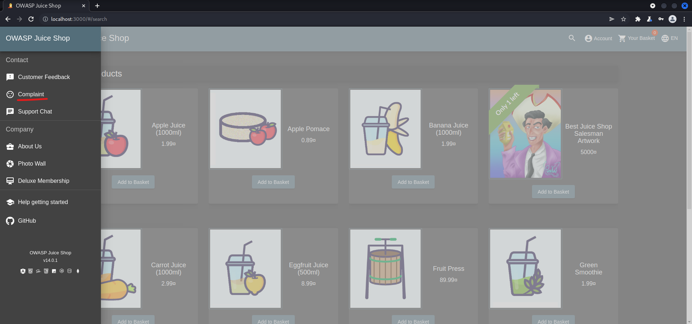
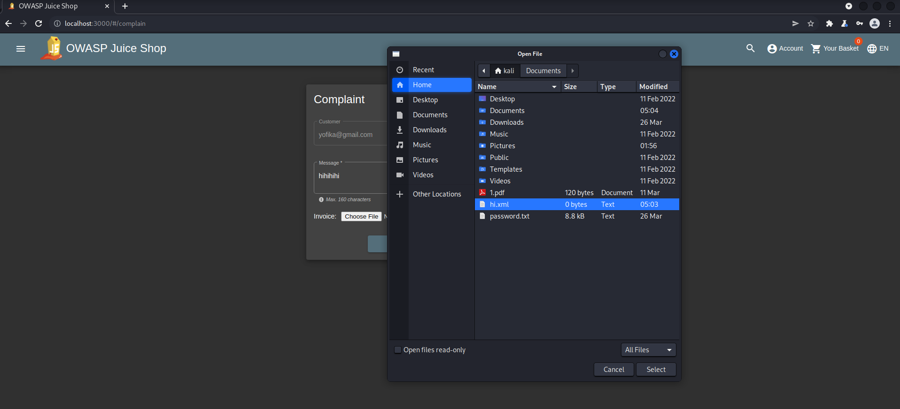
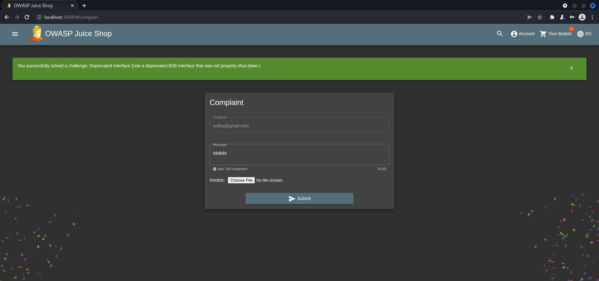

<h1>Praktikum Keamanan Jaringan 
A3 Injection</h1>

Oleh :
Yofika Audrey Tisnawati
3122640036
LJ D4 Teknik Informatika B

<h2><b>A. Error Handling</b></h2>

Tujuan dari Challenge Error Handling adalah untuk memunculkan error, tetapi error yang ditampilkan tidak secara bagus dan konsisten.

1. Buka burpsuite setelah itu matikan intercept dan open browser. Pada browser, buka aplikasi juice shop

2. Kembali pada burpsuite lalu cek HTTP history, cari request baru yaitu /rest/product/search

3. Masukkan payload yang muncul ke repeater dengan cara send to repeater kemudian ubah endpointnya menjadi random text lalu send request dan akan muncul response error 500 atau internal server error yang disini terlihat terdapat error message yang begitu panjangnya dan tidak tertata

<h2><b>B. Deprecated Interface</b></h2>

Challenge Deprecated Interface bertujuan untuk mengetahui antarmuka B2B usang yang tidak dimatikan dengan benar.

1. Buka aplikasi juice shop lalu masuk ke halaman complaint yang terdapat di menu navbar

2. Isikan kolom complaint kemudian unggah file yang berekstensi .xml

3. Setelah itu submit dan challenge berhasil terselesaikan

