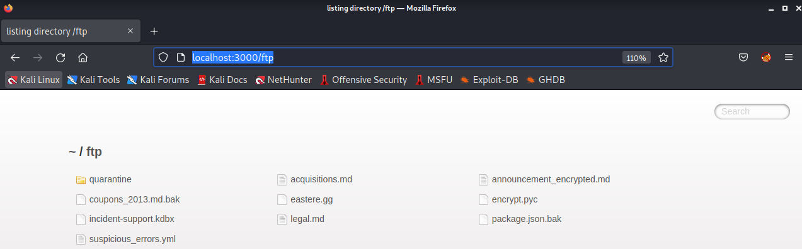
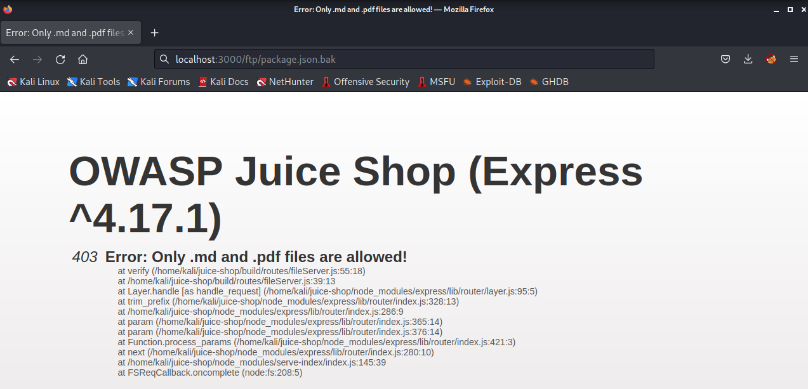
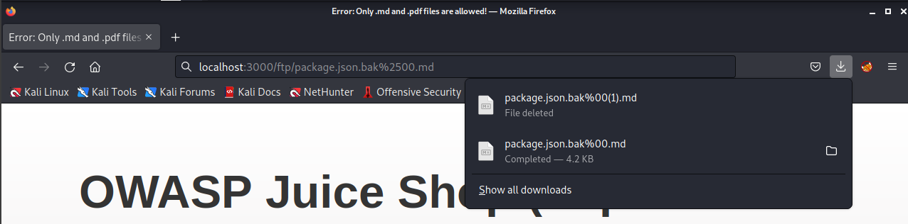
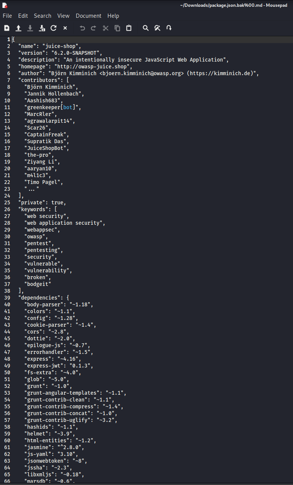
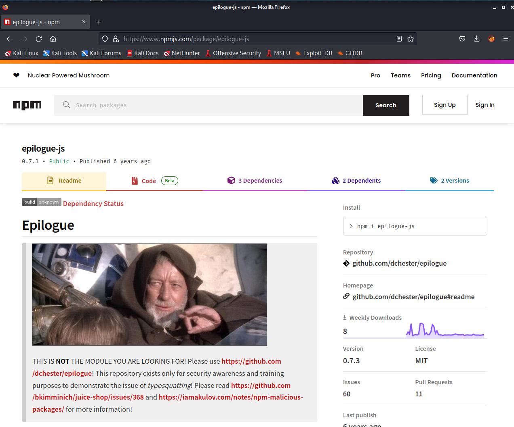
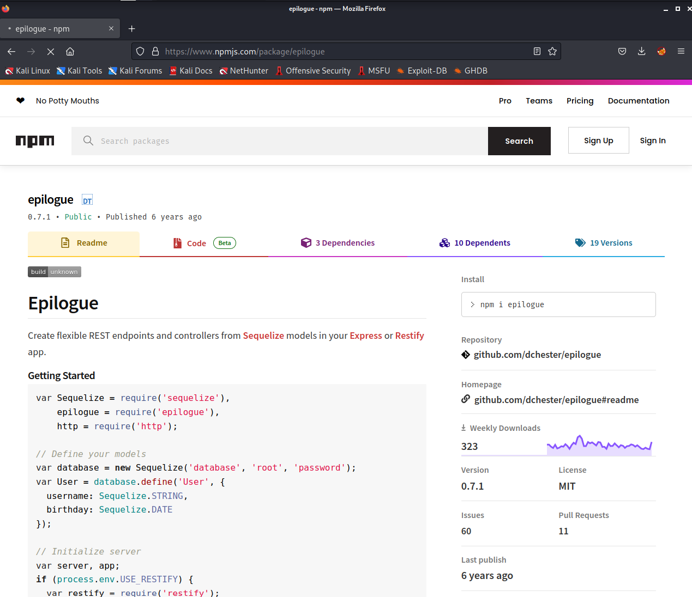
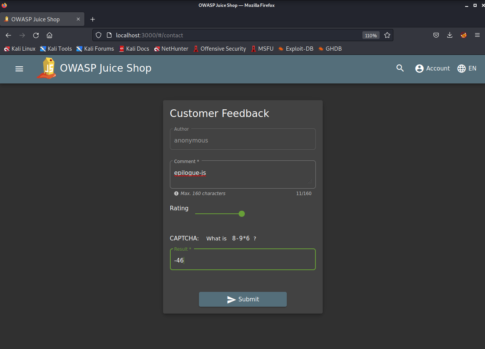
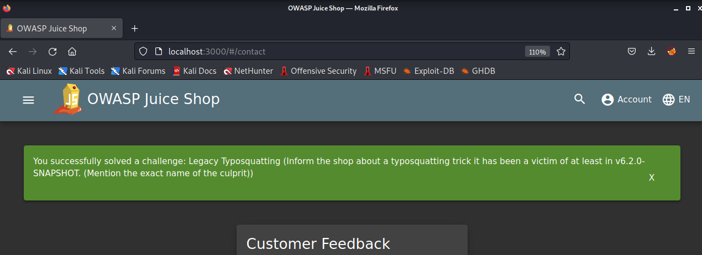

<h1>Praktikum Keamanan Jaringan 
A6 Vulnerable Components</h1>

Oleh :
Yofika Audrey Tisnawati
3122640036
LJ D4 Teknik Informatika B

### A. Legacy Typosquatting

1. Langkah pertama kita pergi ke URL berikut http://localhost:3000/ftp 

2. Setelah itu kita akan ditunjukkan list file yang ada pada directory ftp ini seperti gambar diatas. Kita buka file yang bernama package.json.bak

3. Setelah itu akana muncul tampilan seperti pada gambar diatas yang menampilkan error bahwa file tersebut tidak bisa dibuka. Kita ubah sedikit URL setelah pergi ke halaman package.json.bak menjadi seperti berikut http://localhost:3000/ftp/package.json.bak%2500.md

4. Setelah menjalankan URL tersebut kita akan mendownload file yang berisi package json aplikasi website tersebut

5. Dari file package json ini kita coba check dependencies apa saja yang digunakan oleh aplikasi ini. Setelah itu kita melihat salah satu dependencies yang sepertinya tidak seharusnya atau typo dalam penulisannya tetapi dapat digunakan yaitu yang bernama epilogue-js. Ketika kita buka pada website npm muncul tampilan sebagai berikut
    

6. Untuk package yang seharusnya digunakan adalah package epilogue bukan epilogue-js
    

7. Kita informasikan temuan kita ini pada customer feedback untuk menyelesaikan challange ini

