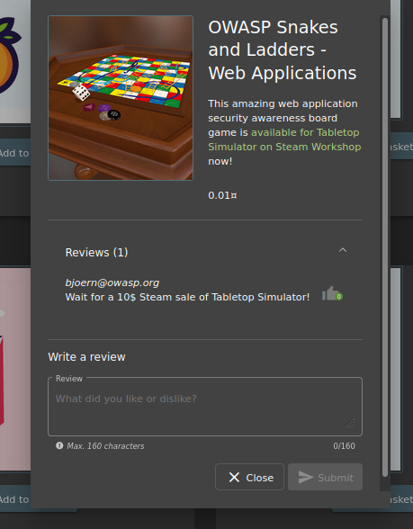
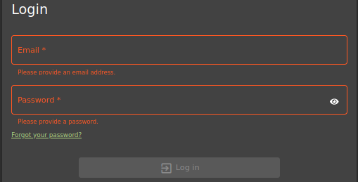
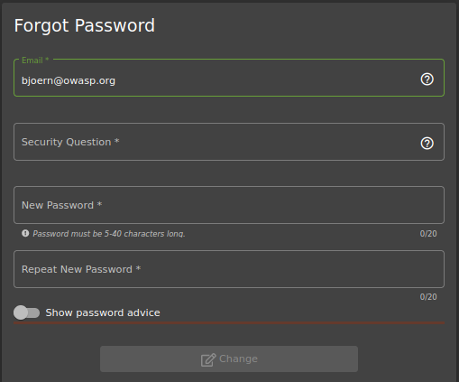
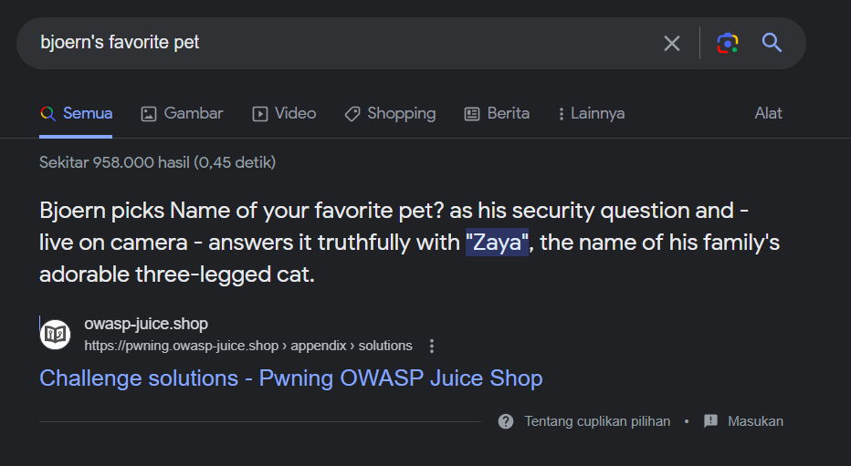
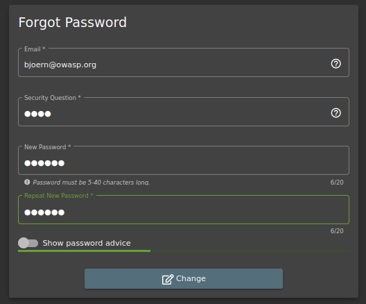
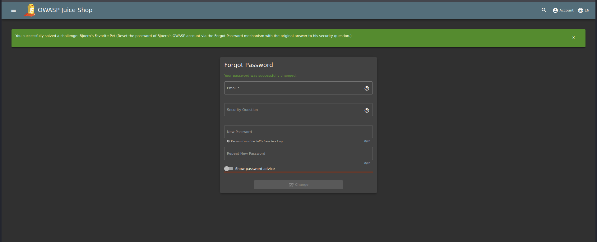
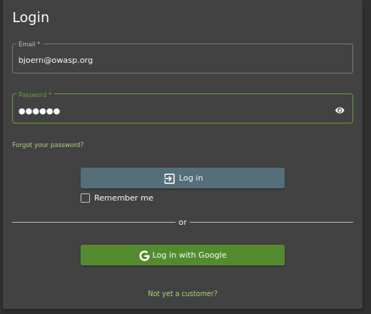
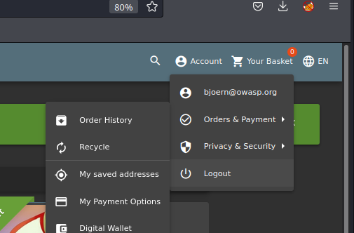

<h1>Praktikum Keamanan Jaringan 
A07 Identification and Authentication Failures</h1>

Oleh :
Yofika Audrey Tisnawati
3122640036
LJ D4 Teknik Informatika B

### A. Bjoern's Favorite Pet

Pada percobaan satu ini akan mereset password dari akun OWASP Bjoern via Forgot Password dengan menjawab pertanyaan keamanan yang diberikan oleh sistem.

1. Mencari akun dari user Bjoern pada review salah satu produk di Juice Shop website

2. Setelah alamat email Bjoern dicopy, pindah ke halaman login, dan klik Forgot your password pada login page karena tidak tahu apa password untuk akun ini

3. Inputkan email bjoern@owasp.org dan akan tampil pertanyaan keamanan dari akun tersebut yaitu nama hewan favorit nya.

4. Untuk bisa menemukan nama hewan favorit Bjoern, mencoba mencari di internet dengan keyword “Bjoern’s favorite pet” dan hasil teratasnya adalah sebagai berikut.

5. Setelah diketahui nama hewan favoritnya adalah Zaya, inputkan pada form lupa password. Ketikkan password baru sesuai keinginan dan klik change. Di sini saya menggunakan password baru: Bjoern

6. Setelah klik change, akan tampil notifikasi berhasil menyelesaikan challenge

7. Untuk membuktikan berhasil login atau tidak menggunakan password yang baru, Kembali ke halaman login dan masukkan email dan password yang baru

