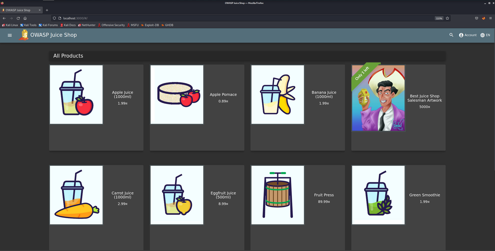
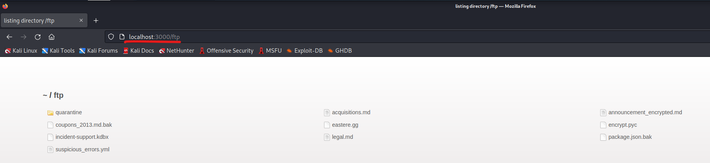
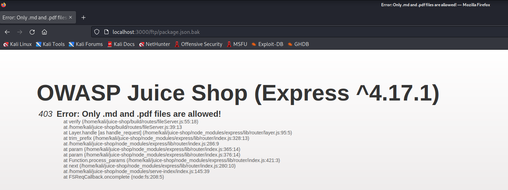
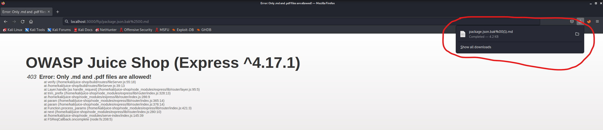
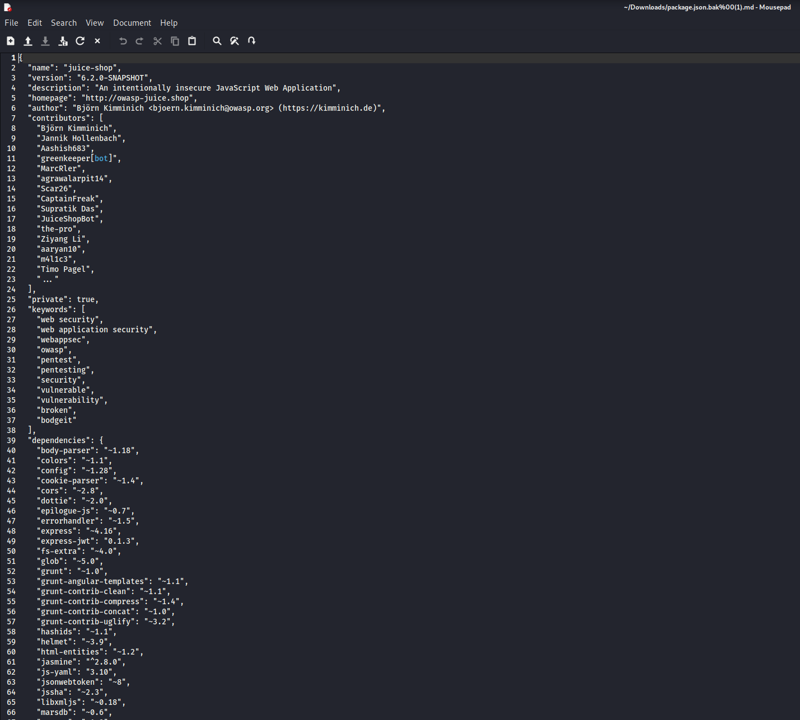

<h1>Praktikum Keamanan Jaringan 
A8 Software and Data Integrity Failures</h1>

Oleh :
Yofika Audrey Tisnawati
3122640036
LJ D4 Teknik Informatika B

Pada percobaan ini akan menunjukan mengunduh kode tanpa pemeriksaan integritas.

1. Buka Aplikasi Juice Shop.

2. Tambahkan /ftp pada URL Juice Shop kita menjadi http://localhost:3000/ftp

3. Klik package.json.bak, maka akan muncul tampilan sebagai berikut

4. ubah URL pakcage.json.bak menjadi sebagai berikut localhost:3000/ftp/package.json.bak%2500.md lalu jalankan, maka kita akan mendownload file package.json tersebut seperti pada gambar berikut

5. ubah URL pakcage.json.bak menjadi sebagai berikut localhost:3000/ftp/package.json.bak%2500.md lalu jalankan, maka kita akan mendownload file package.json tersebut seperti pada gambar berikut

    Berikut adalah isi dari file package.json yang berhasil terdownload

