<h1>Praktikum Keamanan Jaringan 
A9 Security Logging and Monitoring Failures</h1>

Oleh :
Yofika Audrey Tisnawati
3122640036
LJ D4 Teknik Informatika B

Mengakses access log file dari server (masuk ke dalam CWE-532 dikarenakan file penting dari server dapat diakses oleh penyerang)

1. Persiapkan juice shop

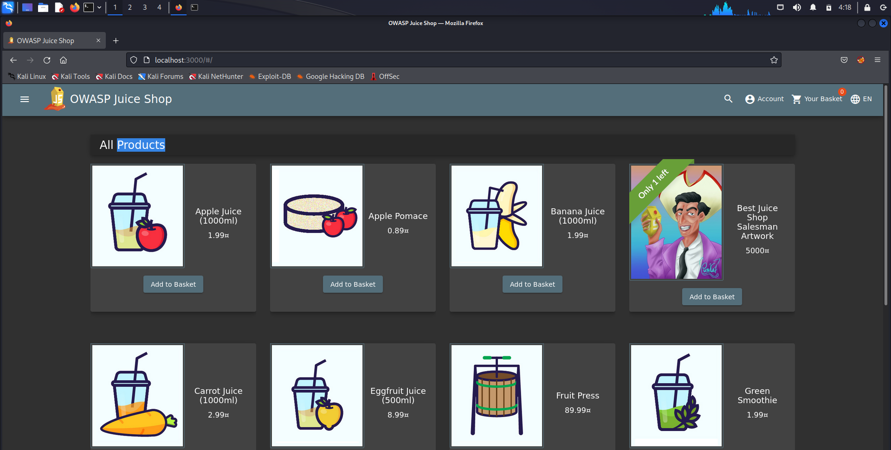

2. Menggunakan FFUF

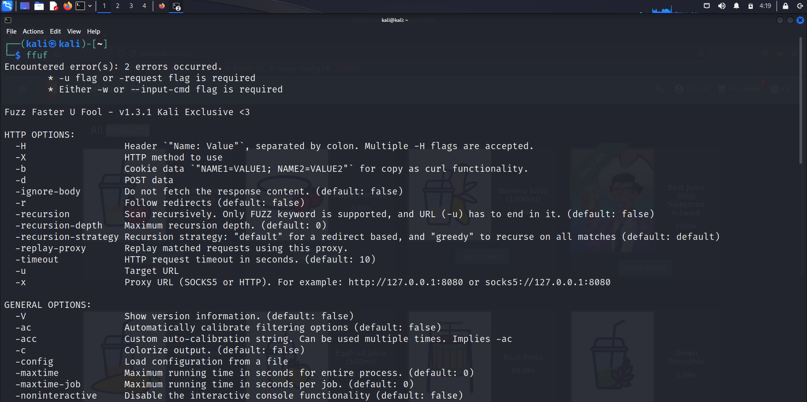

    FFUF merupakan alat untuk melakukan fuzzing pada aplikasi web. Fuzzing adalah proses pengujian perangkat lunak yang melibatkan pengiriman input yang tidak valid, acak, atau tidak terduga ke aplikasi target, dengan tujuan menemukan kelemahan atau kerentanan yang dapat dieksploitasi. FFUF dapat digunakan untuk fuzzing URl, parameter, wordlist generator, filter response, dan pemetaan aplikasi web. Berikut merupakan contoh perintah FFUF :

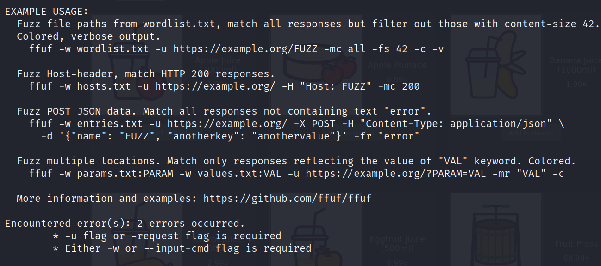

3. Menjalankan perintah FFUF untuk fuzzing URL

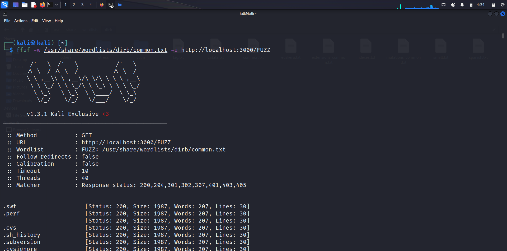

    Perintah tersebut digunakan untuk menjalankan URL dengan url tambahan yang diambilkan dari wordlist “usr/share/wordlists/dirb/common.txt”. Wordlist tersebut berisi daftar kata yang umum digunakan untuk menguji dan mencari direktori atau file yang ada pada server web. Wordlist umum ini biasanya mencakup beberapa nama file umum, direktori umum, atau jalur URL yang sering digunakan dalam aplikasi web. Dari hasil diatas didapatkan status 200 dan size nya 1987 semua. Disini saya akan mencoba menerapkan salah satu string diatas pada browser, seperti gambar dibawah ini :

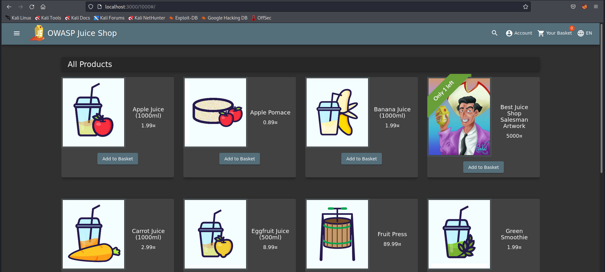

    Pada gambar diatas , mencoba mengakses localhost:3000/1000 , dan ternyata untuk halaman yang ditampilkan adalah list product. Dikarenakan pada hasil sebelumnya status dan size nya sama, hal ini memungkinkan bahwa juice shop memang bisa menerima url lain namun diarahkan ke list product.

4. Menjalankan Fuzzing url dengan menambahkan perintah -fs

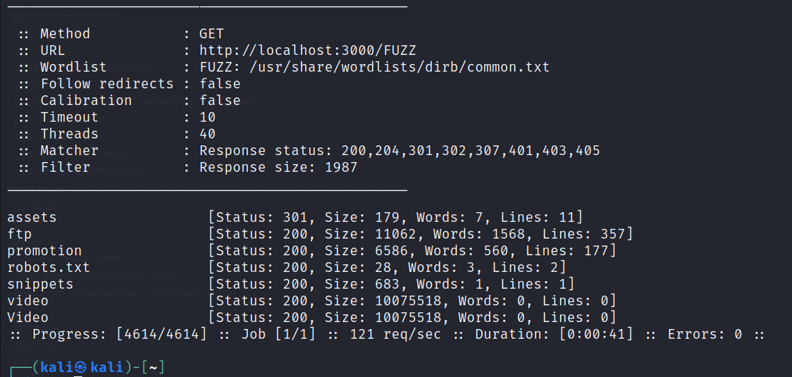

    dikarenakan pada hasil sebelumnya didapatkan size sama 1987 maka dilakukan perintah -fs 1987 untuk menampilkan yang selain size tersebut. Setelah didapatkan hasilnya, maka dapat dicoba pada browser sebagai berikut :

    Percobaan pertama /assets tidak didapatkan hasil apapun, selanjutnya mencoba url yang kedua yaitu /ftp dan didapatkan hasil berikut ini :

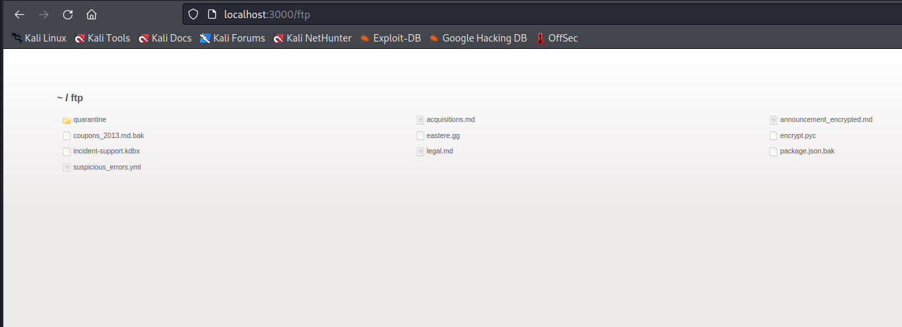

    Dari hasil diatas didapatkan beberapa file, salah satu file yang mungkin bisa mendapatkan informasi lebih detail jika dicari tau lebih dalam adalah file support. Sehingga langkah selanjutnya adalah mencari url yang mengandung /support dengan cara berikut ini :

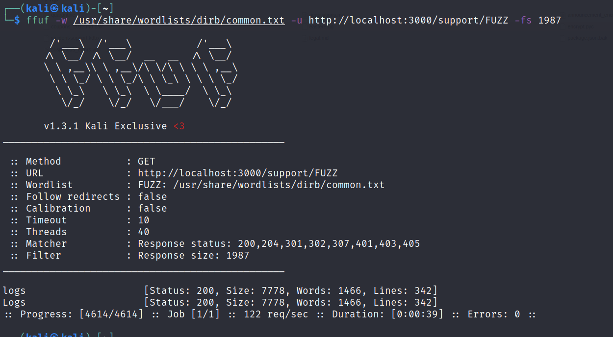

    Pada hasil pertama didapatkan string “Logs”, dan jika dijalankan pada browser didapatkan tampilan berikut ini :

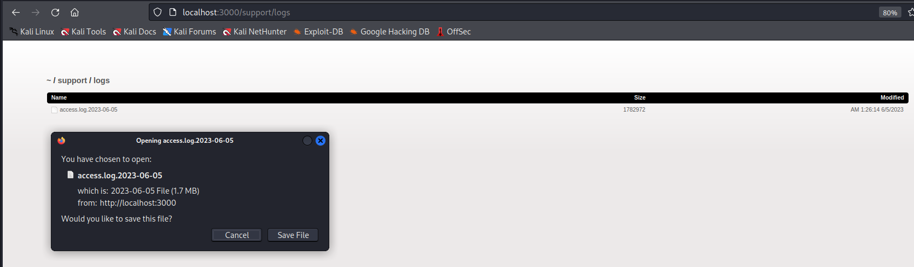
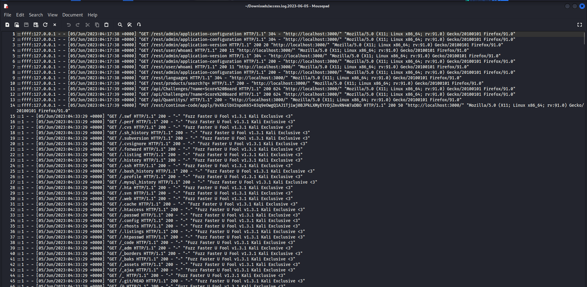

    File tersebut dapat didownload dan jika dillihat isinya seperti gambar diatas. File ini sangat penting dan bersifat rahasia karena memberikan informasi penting tentang aktivitas akses ke sistem. Jika kembali ke juice shop, sudah didapatkan alert berhasil menyelesaikan access log.

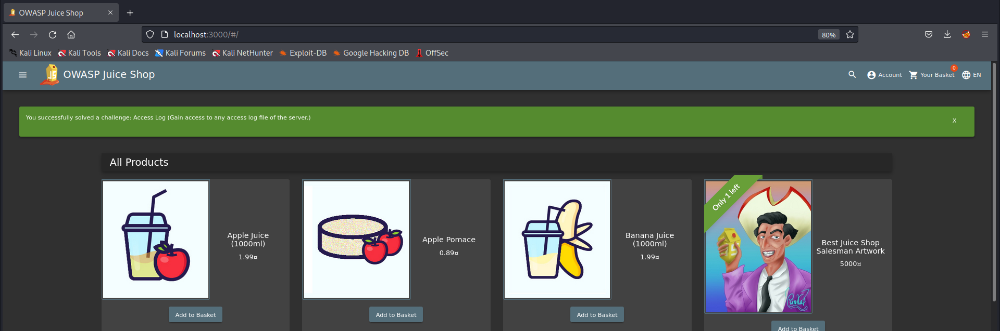
