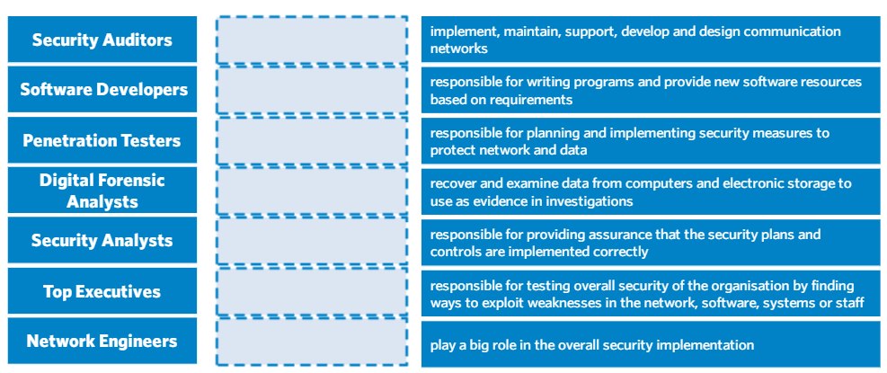

<h1>Tugas Keamanan Jaringan </h1>

<h2>Essay Profesi pada bidang Cyber Security</h2>

Oleh :
Yofika Audrey Tisnawati
3122640036
LJ D4 Teknik Informatika B

<h2><b>Role yang ingin dimiliki</b></h2>

Diantara role pada bidang Cyber Security yang telah dijelaskan diatas, profesi yang cocok untuk sata adalah Software Developer. Peran seorang software developer dalam bidang keamanan cyber sangat penting dan strategis. Mereka bertanggung jawab untuk merancang dan mengembangkan perangkat lunak keamanan yang membantu melindungi data dan informasi dari serangan cyber. Berikut adalah beberapa peran penting seorang software developer dalam bidang keamanan cyber:

1. Merancang dan Mengembangkan Perangkat Lunak Keamanan: Seorang software developer bertanggung jawab merancang dan mengembangkan perangkat lunak keamanan yang dapat melindungi sistem dan data dari serangan cyber. Mereka harus memastikan bahwa perangkat lunak yang dibuat dapat mendeteksi dan mencegah serangan cyber seperti malware, hacking, dan serangan DDoS.

2. Membuat Perangkat Lunak yang Terintegrasi dengan Sistem Keamanan yang Ada: Selain merancang perangkat lunak keamanan yang baru, seorang software developer juga harus mampu membuat perangkat lunak yang dapat terintegrasi dengan sistem keamanan yang sudah ada di dalam organisasi. Hal ini bertujuan untuk memastikan bahwa sistem keamanan tersebut dapat berfungsi secara optimal dan dapat mempertahankan data dari serangan cyber.

3. Menerapkan Praktik Pengembangan Aman: Seorang software developer harus memastikan bahwa perangkat lunak yang dibuat memenuhi standar keamanan yang ditetapkan dan mengikuti praktik pengembangan perangkat lunak yang aman. Mereka harus memastikan bahwa kode sumber tidak mudah disusupi dan melakukan pengujian keamanan terhadap perangkat lunak yang dibuat.

4. Berpartisipasi dalam Tim Keamanan: Seorang software developer juga harus bergabung dengan tim keamanan untuk memantau ancaman keamanan dan memperbarui perangkat lunak keamanan yang sudah ada. Mereka harus memastikan bahwa perangkat lunak keamanan yang dibuat selalu up-to-date dan dapat menghadapi ancaman keamanan yang terbaru.

5. Pelatihan dan Pendidikan: Seorang software developer juga harus terus belajar dan mengikuti perkembangan terbaru dalam teknologi keamanan. Hal ini bertujuan untuk memastikan bahwa mereka selalu up-to-date dengan ancaman keamanan terbaru dan dapat mengembangkan perangkat lunak keamanan yang efektif dan efisien.