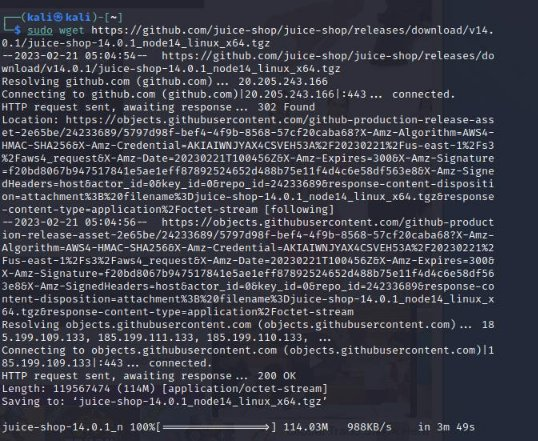
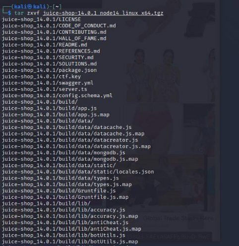
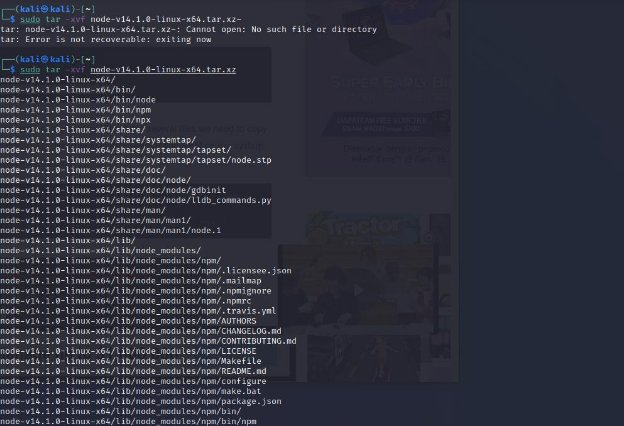
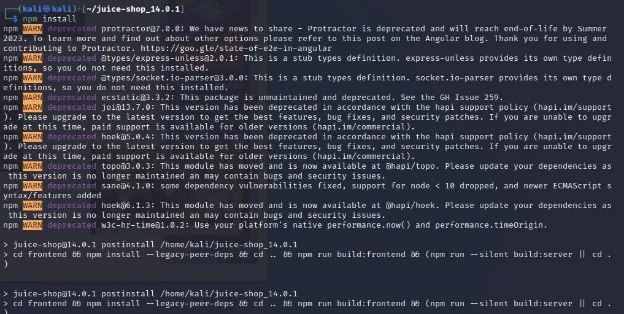
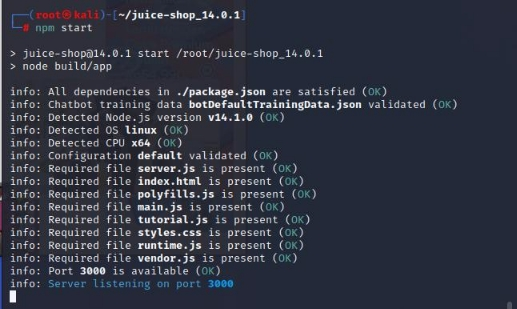
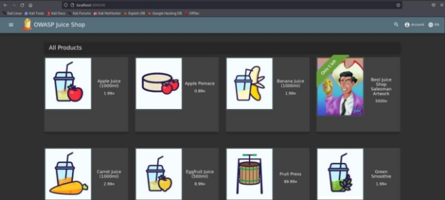

**Laporan Praktikum          Workshop Keamanan Jaringan** 

**OWASP JUICE SHOP INSTALLATION**

**Oleh :** 

Yofika Audrey Tisnawati 3122640036 

LJ D4 Teknik Informatika B 

**POLITEKNIK ELEKTRONIKA NEGERI SURABAYA TAHUN AJARAN 2022/2023** 

**INSTALASI OWASP JUICE SHOP** 

**Step 1 : Download OWASP Juice Shop** 

1. Download latest version dari OWASP Juice Shop yaitu versi 14.0.1 dari official github page OWASP. 

2. Setelah berhasil mengunduh package OWASP yang berbentuk .zip, perlu ekstraksi konten terlebih dahulu menggunakan command tar zxcf. 

**Step 2 : Install NodeJS dan NPM** 

1. Install NodeJS dengan versi yang sesuai dengan OWASP Juice Shop yang diinstall. Karena OWASP yang diunduh adalah versi 14.0.1 maka NodeJS yang digunakan adalah versi 14. 

2. Setelah berhasil mengunduh package NodeJS yang berbentuk .zip, perlu ekstraksi konten terlebih dahulu menggunakan command tar -xvf. 

3. Setelah file “Node” berhasil dibuat di dalam sistem, terdapat beberapa file yang harus dicopy dari folder yang baru saja diextract ke direktori /usr dengan tujuan untuk menginstall NodeJS dan NPM ke dalam sistem dengan command sudo cp -r [extracted- directory-name]/{bin,include,lib,share} /usr/ 

4. Lakukan pengecekan pada direktori dan folder dengan menggunakan command ls 

5. Untuk mengecek versi NodeJS dan versi NPM dapat menggunakan command node – version dan npm –version 

**Step 3 : Install Node Dependecies** 

1. Kembali ke OWASP Juice Shop yang telah diekstrak pada step 1 dengan menggunakan command cd untuk mengubah direktori ke folder tersebut. 

2. Install package dari Node untuk menjalankan OWASP Juice Shop. 

3. Start NPM untuk menjalankan aplikasi Juice Shop dengan menggunakan command npm start pada direktori juice-shop\_14.0.1 

4. Akan muncul nomor port untuk alamat localhost dari Juice Shop. Aplikasi Juice Shop sudah dapat diakses.  

**HUBUNGAN ANATARA OWASP TOP 10 DAN JUICE SHOP** 

- OWASP Top 10 adalah standard awareness document untuk developer dan keamanan jaringan dari sebuah aplikasi. OWASP Top 10 nerepresentasikan risiko keamanan yang paling kritis untuk apliaksi web. 
- Juice shop adalah aplikasi open source project yang sengaja dibuat untuk melatih developers dan meningkatkan awareness akan risiko keamanan jaringan. 
- Jadi OWASP Top 10 berisi challenge-challenge yang harus diselesaikan yang meliputi risiko keamanan jaringan yang paling kritis serta rentan dan Juice Shop sebagai project yang bisa digunakan untuk mengerjakan challenge tersebut. 

**10 KERTENTANAN YANG POPULER DI APLIKASI WEB (OWASP TOP 10)** 

1. **A01:2021-Broken Access Control** (Kelemahan Access Control)** 

34 CWE (Common Weakness Enumeration) yang dipetakan ke Broken Access Control memiliki lebih banyak kemunculan dalam aplikasi dariapda kategori lainnya. Broken Access Control memungkinkan entri yang tidak sah yang dapat mengakibatkan kerentanan data dan file yang bersifat sensitif. Kontrol akses yang lemah terkait manajemen kredensial dapat diatasi dengan metode coding yang unik dan beberapa tindakan khusus seperti mematikan akun admin dan two-factor authentication. 

2. **A02:2021-Cryptographic Failures** (Kegagalan Kriptografi)** 

Sebelumnya dikenal sebagai Pengungkapan Data Sensitif.. Fokus baru di sini adalah pada kegagalan terkait Kriptografi yang sering mengarah pada sistem yang telah terserang oleh peretas. API (Application Programming Interface) yang menghasilkan koneksi dan layanan pihak ketiga dapat dimanfaatkan oleh peretas karena data transmisi tidak aman. 

3. **A03:2021-Injection** (Injeksi)** 

Injeksi mungkin terjadi apabila peretas memanipulasi kode yang tidak aman kemudian diinjeksikan ke dalam suatu program. Seringkali program yang diinjeksikan tidak dapat mengidentidikasi data yang terinjeksi. Jadi, peretas dapat mengetahui informasi rahasia, karena sistem mengidentifikasi bahwa peretas adalah pengguna yang terpercaya 

4. **A04:2021-Insecure Design** (Kekurangan pada Desain)** 

Insecure design merupakan sebuah kategori baru dengan fokus pada risiko yang terkait dengan kekurangan desain. Kategori ini membahas pentingnya penggunaan pemodelan ancaman, pola dan desain yang aman, dan arsitektur referensi 

5. **A05:2021-Security Misconfiguration** (Kelemahan Konfigurasi Keamanan)** Kategori ini sangat diperlukan karena mampu menunjukkan perangkat lunak yang dapat dikonfigurasi. Kategori ini mengatasi kesalahan konfigurasi yang dapat menimbulkan signifikan dengan memberikan akses kepada penyerang untuk masuk ke dalam sistem. 
5. **A06:2021-Vulnerable and Outdated Components** (Komponen yang Rentan dan Kadaluarsa)** 

Sebelumnya dikenal dengan Using Components with Known Vulnerabilities. Peretas dapat menyerang dan memanipulasi keamanan kode serta API sistem. Serangan ini dilakukan karena komponen pihak ketiga dan ketergantungan yang tidak aman. 

7. **A07:2021-Identification and Authentication Failures** (Kegagalan Identifikasi dan Autentikasi)** 

Sebelumnya dikenal dengan Broken Authentication dan sekarang termasuk CWE yang lebih terkait dengan kegagalan identifikasi. Risiko yang signifikan dapat memungkinkan peretas untuk menyalin peran dari identitas pengguna yang sah. Penggunaan alat pemindai DAST dan SCA dapat mendeteksi dan mengatasi permasalahan yang mencakup kesalahan implementasi sebelum programmer mengaplikasikan kode. 

8. **A08:2021-Software and Data Integrity Failures** (Kegagalan Perangkat Lunak dan Keutuhan Data)** 

Merupakan sebuah kategori baru pada tahun 2021. Kategori ini berfokus pada keputusan terkait pembaruan perangkat lunak, data penting, dan pipeline CI/CD tanpa memverifikasi integritas. Kategori ini merupakan salah satu dampak dari CVE (Common Vulnerability and Exposures) dan CVSS (Common Vulnerability Scoring System). 

9. **A09:2021-Security Logging and Monitoring Failures** (Kegagalan pada Keamanan Logging dan Monitoring Data)** 

Naik ke posisi kesembilan. Kategori ini diperluas untuk mencakup lebih banyak jenis kegagalan. Peretas bergantung pada kurangnya pemantauan dan pemulihan yang lambat untuk melakukan penyerangan. Aktivitas login tanpa kegagalan, kontrol akses dan validasi data dari server dapat mengidentifikasi aktivitas yang mencurigakan dalam sistem. 

10. **A10:2021-Server-Side Request Forgery** (SSRF)** 

Merupakan kategori baru dan berfokus pada pengujian. SSRF berkaitan dengan cakupan pengujian di atas rata-rata terhadap potensi eksploitasi dan dampak. Pada kategori ini, skenario pada tim keamanan juga menuntut relevansi data.** 
