**Laporan Praktikum Keamanan Jaringan** 

**BROKEN ACCESS CONTROL** 

**Oleh :** 

Yofika Audrey Tisnawati 3122640036 

LJ D4 Teknik Informatika B 

**POLITEKNIK ELEKTRONIKA NEGERI SURABAYA TAHUN AJARAN 2022/2023** 

Access Control menetapkan sebuah peraturan yang dimana user tidak dapat melakukan sebuah aksi diluar permission yang diberikan. Kegagalan atas hal ini dapat mengakibatkan pengeluaran informasi yang tidak diizinkan, modifikasi, atau penghancuran dari semua data atau pemberlakuan sebuah fungsi bisnis di luar limit sebuah user.  

Access control yang bermasalah memungkinkan hacker untuk melewati proses autorisasi serta melakukan hal-hal yang biasanya hanya dapat dilakukan oleh admin. 

1. Install burpsuite 

2. Buka aplikasi burpsuite 

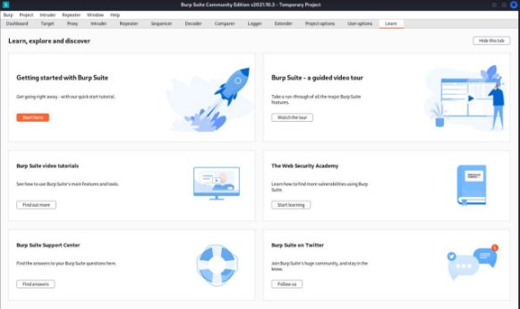

3. Jalankan aplikasi juice shop 

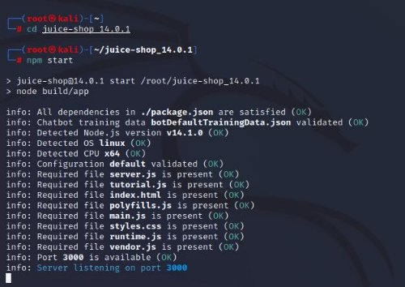

4. Masuk ke burpsuite dan buka browser dari burpsuite. Jangan lupa untuk mematikan intercept terlebih dahulu lalu buka halaman juice shop. 

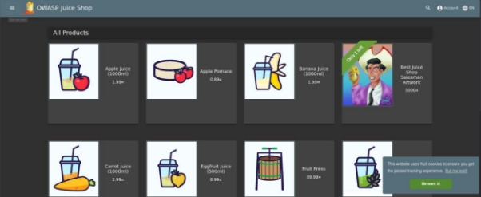

5. Login ke akun juice shop dan tambahkan beberapa product ke basket 

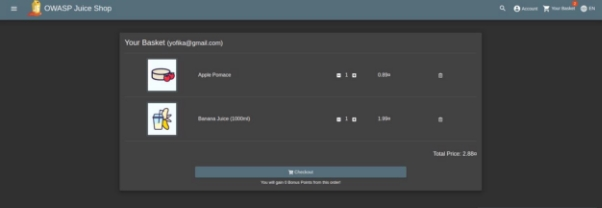

6. Buka kembali burpsuite lalu buka http history untuk tracing http requestnya. Karena tujuan dari tracing http request ini adalah untuk melihat keranjang milik user id lain, kita akan melihat terlebih dahulu data apa yang dikirimkan ketika user menambahkan product ke keranjangnya dan pada response kitab isa melihat barang apa saja yang ada di basket user kita (akun yang sedang login) 

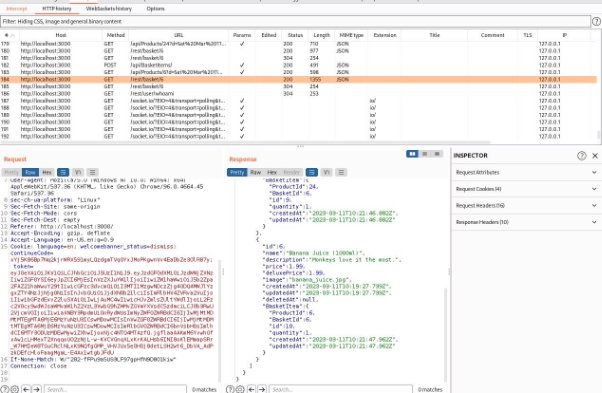

7. Untuk melihat keranjang user lain disini saya menyalin request yang dikirimkan oleh user 6 dan akan terlihat response yang diberikan adalah keranjang milik user 6 

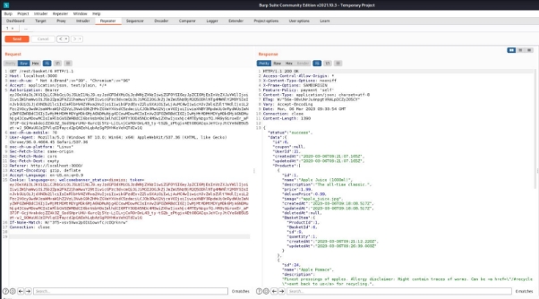

8. Ketika get requestnya diubah menjadi basket/2 ternyata id user yang diberikan adalah id user 2 dan sebenarnya pada burpsuite pun kita sudah bisa melihat isi keranjang dari user id 2 yaitu raspberry juice 

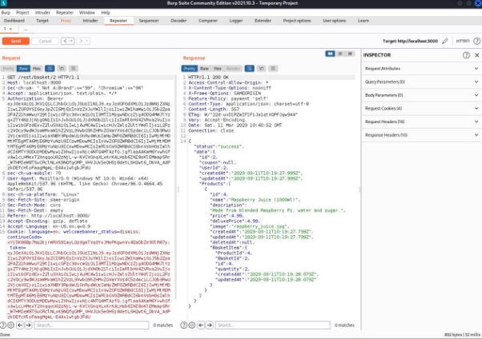

9. Namun untuk menampilkannya pada website kita perlu mengubah script yang ada pada intercept dan mengubah basketnya menjadi 2 lalu forward dalam kondisi intercept on  

10. Setelah itu muat kembali aplikasi juice shop dan akan tampil isi dari keranjang user 2 

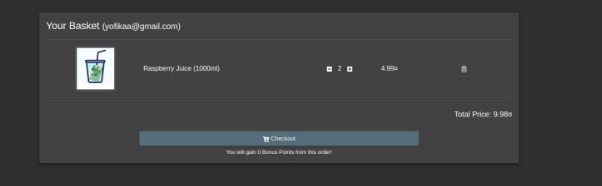

11. Untuk memanipulasi keranjang milik user id lain, saya akan coba untuk menambah isi dari keranjang 

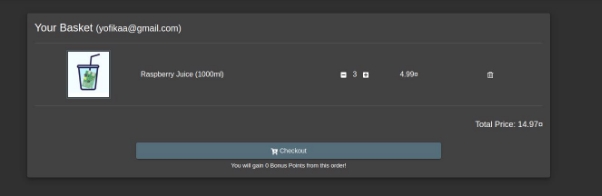

**BROKEN ACCESS CONTROL ADMIN SECTION** 

1. Sebelum masuk menggunakan akun admin, kita perlu mengetahui email user id yang memiliki role admin. Pada review product tertera email admin yang bisa kita gunakan untuk masuk sebagai admin. 

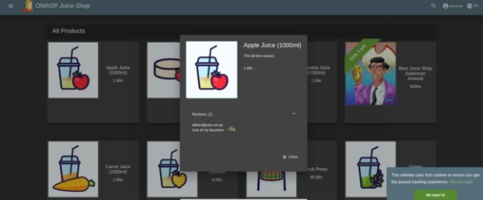

2. Selanjutnya buka burpsuite lalu pada target tambahkan target scope dan masukkan url juice shop yaitu localhost:3000 

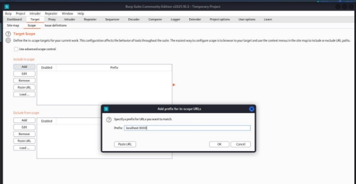

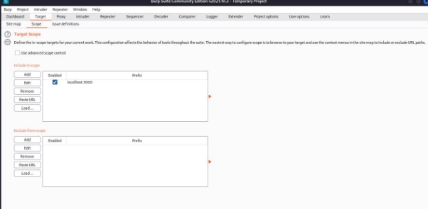

3. Setelah itu pada option intercept client request enable URL  

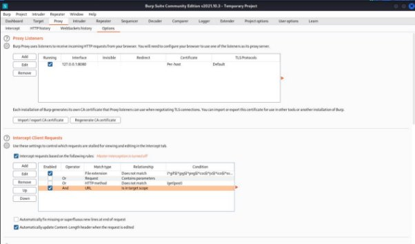

4. Lalu nyalakan kembali intercept dan masuk ke halaman login juice shop menggunakan email admin. Akan tampil pada intercept email dan password yang telah kita masukkan di halaman login sebelumnya. 

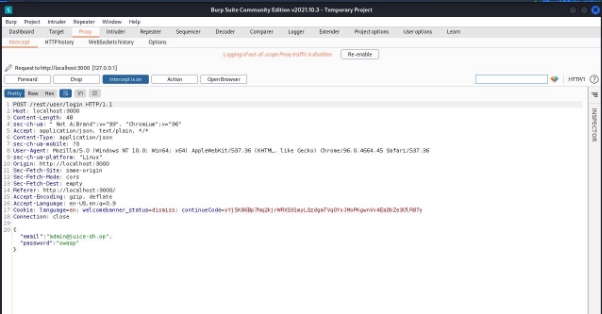

5. Send to intruder 

6. Setting intruder terlebih dahulu. Pada target masukkan target hostnya yaity localhost:3000 dan portnya 8080 

7. Setelah itu pada position clear symbol kecuali pada password  

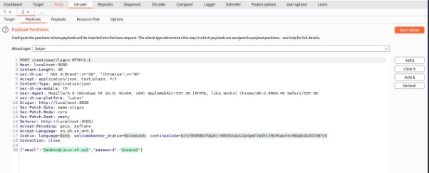

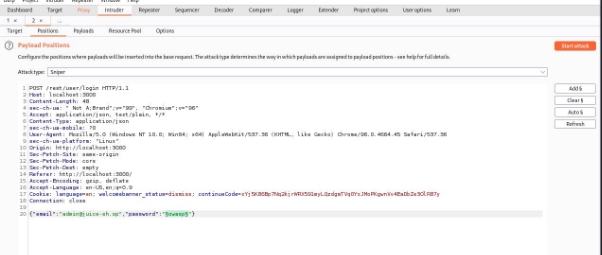

8. Lalu pada payload option load dataset password yang telah disiapkan  

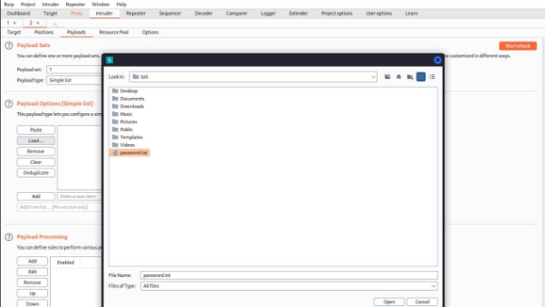

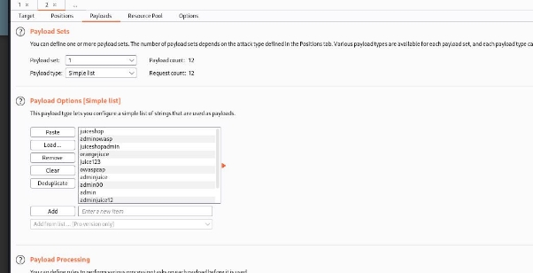

9. Setelah itu akan muncul password yang sesuai dengan email tersebut dan kita akan bisa masuk dengan menggunakan password tersebut. 

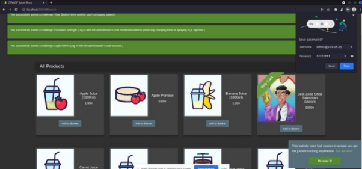

